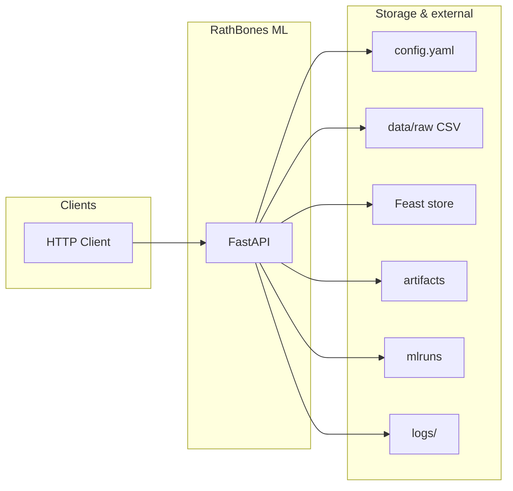
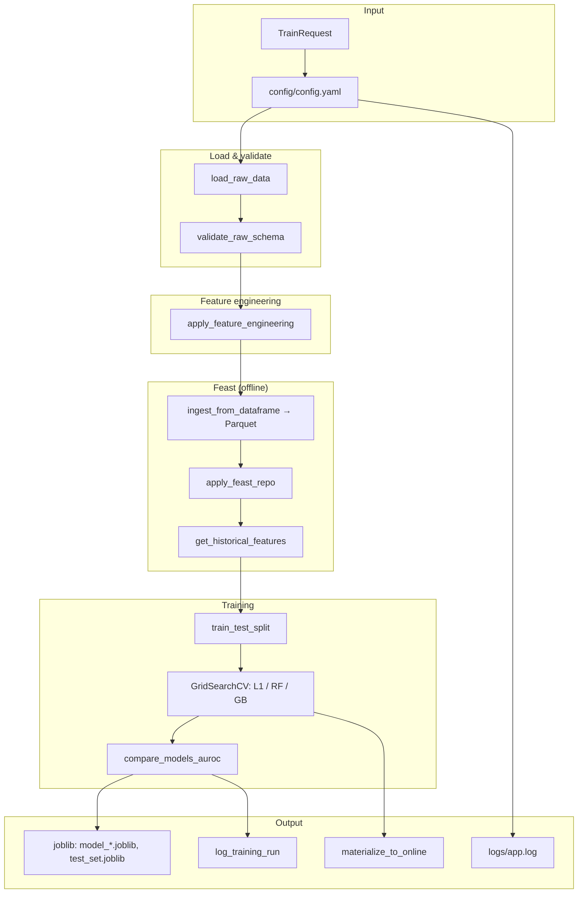
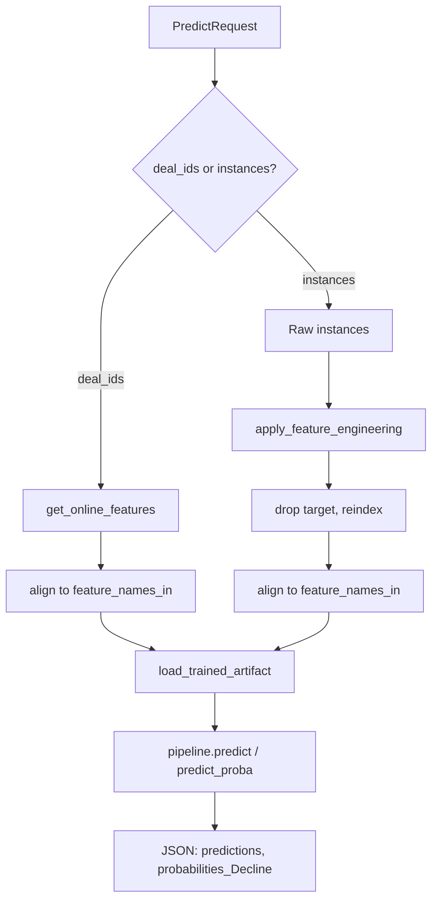
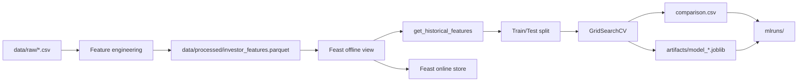

# RathBones — Architecture

High-level architecture for the investor commit/decline ML pipeline (FastAPI, Feast, sklearn, MLflow).

---

## System context



---

## Train pipeline (POST /train)



---

## Predict (POST /predict)

Two paths: **by deal_ids** (Feast online) or **by instances** (raw rows).



---

## Component map

| Layer        | Component            | Role |
|-------------|----------------------|------|
| **Web**     | `web/api.py`         | FastAPI: `/`, `/health`, `POST /train`, `POST /predict` |
| **Pipeline**| `pipeline/run.py`    | `run_train_evaluate_pipeline`, `setup_logging` |
| **Core**    | `core/config.py`    | `load_config`, `get_project_root` |
| **Data**    | `data/load.py`       | Load raw CSV |
| **Data**    | `data/validate.py`  | Schema & commit validation |
| **Features**| `features/engineering.py` | Derived features, drop, one-hot, target split |
| **Store**   | `store/feast_store.py` | Ingest, apply repo, historical/online features, materialize |
| **Models**  | `models/train.py`   | GridSearchCV, joblib artifacts |
| **Models**  | `models/evaluate.py`| AUROC from probabilities, compare_models_auroc |
| **Tracking**| `tracking/mlflow_tracking.py` | setup_mlflow, log_training_run |

---

## Data flow (training)



---

## Directory layout (relevant)

```
RathBones/
├── config/
│   └── config.yaml          # data paths, feast, models, tuning, logging, mlflow
├── feature_repo/            # Feast repo (entity + feature view → Parquet)
│   ├── feature_store.yaml
│   └── features.py
├── data/
│   ├── raw/                 # Input CSV
│   └── processed/           # investor_features.parquet (Feast source)
├── artifacts/               # model_*.joblib, test_set.joblib, comparison.csv
├── mlruns/                  # MLflow tracking (file backend)
├── logs/
│   └── app.log              # File logging
└── src/investor_ml/
    ├── core/                # Config (get_project_root, load_config)
    ├── web/                 # FastAPI (api.py)
    ├── store/               # Feast feature store
    ├── tracking/            # MLflow tracking
    ├── data/
    ├── features/
    ├── models/
    └── pipeline/
```

---

*Generated for RathBones ML. View Mermaid diagrams in GitHub, VS Code (Mermaid extension), or [mermaid.live](https://mermaid.live).*
